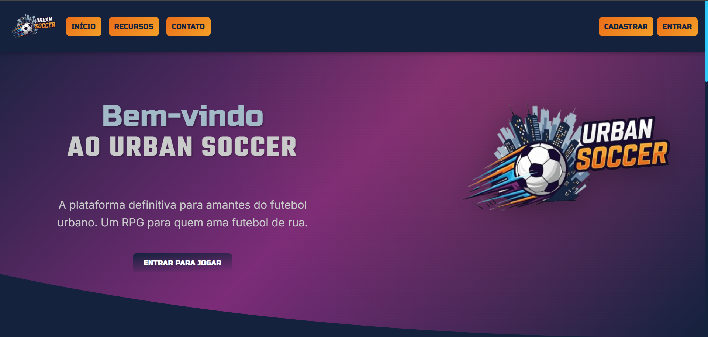
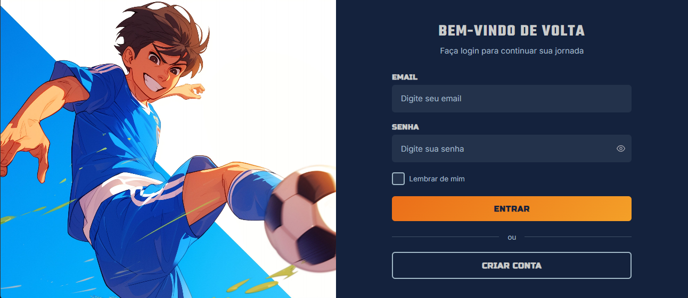
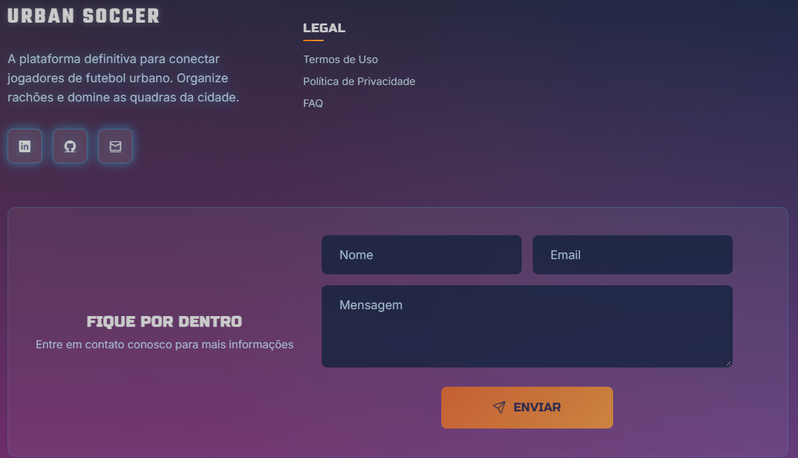

# Guia de Estilo (Style Guide) - Urban Soccer RPG

## 1. Introdução

Este documento serve como a fonte central de verdade para a identidade visual do Urban Soccer RPG. O objetivo é garantir consistência, coesão e uma aparência profissional em todas as telas e componentes do jogo. Seguir este guia facilita o desenvolvimento e mantém a experiência do usuário imersiva e agradável.

---

## 2. Cores

Nossa paleta de cores é inspirada na identidade visual da logo, transmitindo uma atmosfera urbana, energética e noturna. As cores foram divididas em categorias para facilitar a aplicação.

### Paleta Principal

#### Cores de Fundo e Base

* **Azul Noite (`#14223D`)**

  * **Uso Recomendado:** Cor de fundo principal para telas, menus e contêineres. É a base escura que faz todos os outros elementos se destacarem.
* **Roxo Urbano (`#7C2C78` / `#792A76`)**

  * **Uso Recomendado:** Para painéis secundários, cards ou gradientes sutis no fundo, adicionando profundidade à interface.

#### Cores de Ação e Destaque (Acentos)

* **Laranja Vibrante (`#EB6E19`)**

  * **Uso Recomendado:** A principal cor de ação (call-to-action). Use para botões primários ("Entrar", "Confirmar"), alertas importantes e elementos que precisam de atenção imediata.
* **Amarelo Dourado (`#F4A028`)**

  * **Uso Recomendado:** Para estados de "hover" (mouse sobre) em botões laranja, ícones de destaque ou como cor secundária em gradientes de ação.
* **Ciano Elétrico (`#30C9F9`)**

  * **Uso Recomendado:** Acento secundário. Ideal para destacar campos de formulário selecionados, ícones de status, barras de progresso (energia/XP) e textos de stats.
* **Azul Acento (`#1095CF`)**

  * **Uso Recomendado:** Para botões secundários, links e elementos interativos que não são a ação principal da tela.

#### Cores Neutras (Textos e Suporte)

* **Cinza Claro (`#C9CBCA`)**

  * **Uso Recomendado:** A cor principal para todo o texto de corpo e parágrafos. Garante ótima legibilidade sobre o fundo `Azul Noite`.
* **Cinza Neutro (`#A2B9C7`)**

  * **Uso Recomendado:** Para textos secundários (placeholders em campos de texto, informações menos importantes) e bordas de contêineres.

---

## 3. Tipografia

A hierarquia tipográfica define a voz e a clareza do jogo. Cada fonte tem um papel específico.

### Fonte Primária (Impacto e Títulos)

* **Fonte:** `Teko`
* **Peso:** SemiBold (600), Bold (700)
* **Uso:** Títulos de tela (`LOGIN`, `MENU PRINCIPAL`), placares, pop-ups de grande impacto (`GOL!`, `VITÓRIA!`). Deve ser usada em caixa alta (UPPERCASE) para máximo efeito.

### Fonte Secundária (Subtítulos e Nomes)

* **Fonte:** `Russo One`
* **Peso:** Regular (400)
* **Uso:** Nomes de jogadores, nomes de times, subtítulos em menus. É forte e legível, servindo como uma ponte entre a `Teko` (impacto) e a `Inter` (leitura).

### Fonte de Acento (UI Retrô e Stats)

* **Fonte:** `Press Start 2P`
* **Peso:** Regular (400)
* **Uso:** Exclusivamente para valores numéricos de stats (FOR, VEL, CHU), labels curtas e elementos que buscam uma forte sensação de nostalgia arcade. Evitar em frases longas.

> `CHU: 95`

### Fonte Terciária (Corpo de Texto e Diálogos)

* **Fonte:** `Inter`
* **Peso:** Regular (400), Bold (700) para destaques.
* **Uso:** A fonte padrão para todos os textos de leitura: diálogos, descrições de itens, missões, parágrafos. Sua clareza é a prioridade máxima.

---

## 4. Uso Prático em Componentes

### Botões

* **Botão Primário:**
  * Fundo: `Laranja Vibrante (#EB6E19)`
  * Texto: `Azul Noite (#14223D)`
  * Fonte: `Teko` ou `Russo One`
* **Botão Secundário:**
  * Fundo: `Azul Acento (#1095CF)`
  * Texto: `Cinza Claro (#C9CBCA)`
  * Fonte: `Russo One`

### Campos de Texto (Input)

* **Estado Padrão:**

  * Fundo: `Azul Noite (#14223D)`
  * Borda: `Cinza Neutro (#A2B9C7)`
  * Texto Placeholder: `Cinza Neutro (#A2B9C7)`
* **Estado de Foco (Selecionado):**

  * Borda: `Ciano Elétrico (#30C9F9)`
  * Texto Digitado: `Cinza Claro (#C9CBCA)`

